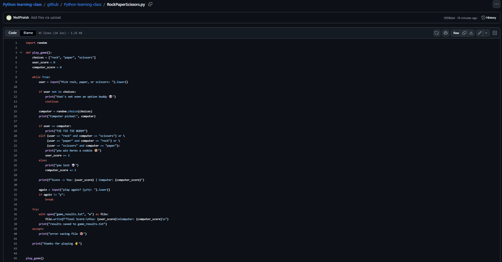
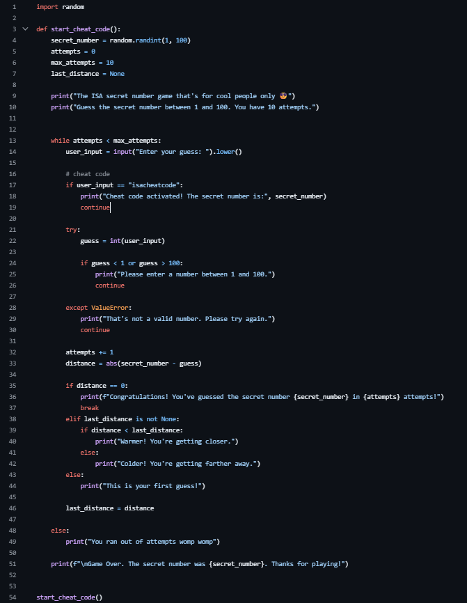

<!DOCTYPE html>
<html lang="en">
<head>
    <meta charset="UTF-8">
    <meta name="viewport" content="width=device-width, initial-scale=1.0">
    <title>Python Foundations Portfolio</title>

    <!-- CSS File -->
    <link rel="stylesheet" href="style.css">
</head>

<body>

    <!-- ================= HERO SECTION ================= -->

    <section class="hero">

        <h1>Python Foundations</h1>

        

            Professional Coding Journal | 2026
        

        <a href="https://github.com/NotProish/Python-learning-class"
           target="_blank"
           class="btn">

           View Repository

        </a>

    </section>

    <!-- ================= MAIN CONTENT ================= -->

    <main class="container">

        <!-- ABOUT SECTION -->

        <section class="card">

            <h2>About the Developer / Student</h2>

            

                I am a student developer passionate about Python,
                programming, cybersecurity, and network engineering.
                This portfolio documents my learning journey,
                projects, and coding progress throughout my
                Python Foundations coursework.
            

        </section>

        <!-- DOCUMENTATION SECTION -->

        <section class="card" id="readme-container">

            <h2>Project Documentation</h2>

            <a href="https://github.com/NotProish/Python-learning-class/blob/main/github/Python-learning-class/README.md"
               target="_blank"
               class="documentation-card">

                <h3>View Full Project Documentation</h3>

                

                    Read my coding journey, lesson notes,
                    project logs, and reflections directly
                    on GitHub.
                

                
                    Go to GitHub README
                

            </a>

        </section>

        <!-- PROJECTS SECTION -->

        <h2 class="section-title">
            Instructional Modules & Projects
        </h2>

        

            <!-- PROJECT 1 -->

            <a href="images/rockpaper.png"
               target="_blank"
               class="card project-card">

                <h3>Rock Paper Scissors</h3>

                

                    A functional Python game using loops,
                    user input, and conditional logic.
                

                

            </a>

            <!-- PROJECT 2 -->

            <a href="images/secretnumber.png"
               target="_blank"
               class="card project-card">

                <h3>Secret Number</h3>

                

                    Interactive guessing game featuring
                    randomized values and hidden admin logic.
                

                

            </a>

            <!-- FINAL PROJECT -->

            <a href="https://github.com/NotProish/Python-learning-class/tree/main/github/Python-learning-class"
               target="_blank"
               class="card project-card final-project">

                <h3>Final Project</h3>

                

                    My culminating Python project combining
                    the concepts learned throughout the course.
                

                
                    View Project
                

            </a>

        

    </main>

</body>
</html>
